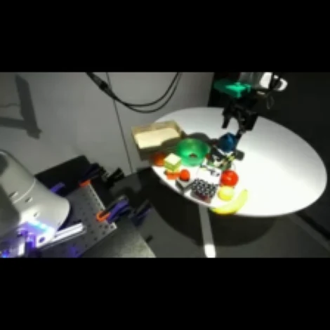
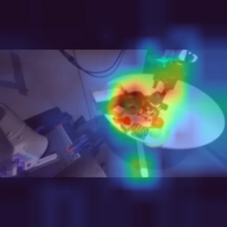
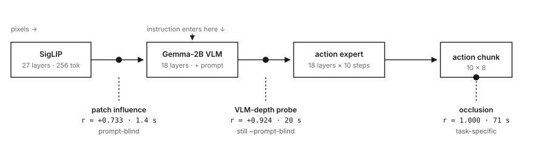

# Albert Liu

**Embodied AI & Robot Learning** — world models, vision-language-action policies, onboard deployment.

Machine learning engineer with 6+ years building the full **perception → world model → action** stack for
autonomous machines, now focused on humanoid robotics and embodied AI. Deep hands-on experience with
multimodal transformers that fuse camera, LiDAR, and language into a shared latent space, and with learned
world models that forecast future states for closed-loop control. Working knowledge of modern robot
foundation models — OpenVLA / OpenVLA-OFT, π0 (openpi), and NVIDIA Isaac GR00T — including action chunking,
parallel decoding, and imitation-learning fine-tuning. Proven record taking research models to production:
custom CUDA kernels, TensorRT/ONNX deployment, and real-time inference on the NVIDIA Xavier/Orin/Thor
compute humanoid platforms run on.

📍 San Jose, CA · [albertnew2012@gmail.com](mailto:albertnew2012@gmail.com) · [LinkedIn](https://www.linkedin.com/in/zhengzhiliu/) · [Google Scholar](https://scholar.google.com/citations?user=JZgUXF8AAAAJ)

---

## Experience

| Role | Company | |
|---|---|---|
| Senior Machine Learning Engineer | **Lucid Motors** — Newark, CA | 12/2024 – Present |
| Senior Machine Learning Engineer | **SafeAI** (autonomous heavy equipment) — San Jose, CA | 03/2024 – 10/2024 |
| Senior ADAS System Development Engineer | **Audi of America** (Volkswagen Group) — San Jose, CA | 05/2022 – 01/2024 |
| Research Scientist | **RefleXion Medical** — Hayward, CA | 01/2020 – 05/2022 |

## Education

| | | |
|---|---|---|
| **Postdoctoral Research Fellow**, Deep Learning for Imaging & Perception | Stanford University | 2018 – 2020 |
| **Ph.D., 3D Imaging Theory and Applications** | University of Tennessee, Knoxville | 2014 – 2018 |

## Technical Skills

**Vision-Language-Action (VLA) Policies** — OpenVLA / OpenVLA-OFT, π0 (openpi), NVIDIA Isaac GR00T;
diffusion & flow-matching action experts; action chunking, parallel decoding, continuous action regression;
discrete action tokenization vs. continuous regression; imitation-learning fine-tuning;
policy interpretability — attention rollout, occlusion attribution, receptive-field analysis

**Robot Learning & World Models** — World-model–action (WMA) architectures and latent world models;
closed-loop future-state prediction; sim-to-real transfer; teleoperation & demonstration data pipelines

**Generative & Foundation Models** — LLMs, VLMs, multimodal fusion architectures, LoRA / PEFT fine-tuning,
diffusion models, VAE/GAN, agentic multi-model pipelines, LLM-as-judge evaluation loops, real-time
speech pipelines (STT / TTS / VAD)

**3D Perception & Spatial Reasoning** — Camera & LiDAR 3D detection and tracking, BEV representation learning,
occupancy prediction, LiDAR–camera fusion, sensor calibration, auto-labeling, end-to-end driving models

**Simulation & Robotics Systems** — ROS / ROS2, Isaac Sim / Isaac Lab, MuJoCo, LeRobot, synthetic data
generation, closed-loop evaluation, Docker, Linux, Git

**Deployment & Optimization** — TensorRT / ONNX Runtime, custom CUDA plugins, quantization, real-time
inference on NVIDIA Xavier / Orin / Thor, safety-OS deployment

**Programming & Frameworks** — Python, C++, CUDA, PyTorch, TensorFlow, OpenCV, Open3D, PCL

---

# Selected Repositories

## VLA Interpretability — *What the Robot Needs to See*

**[📊 Read the report](https://albertnew2012.github.io/openpi-pytorch/)** · [source](https://github.com/albertnew2012/openpi-pytorch)

Attention shows where a policy *looked*; occlusion shows which pixels actually *change the action*.
On π₀ / π₀.₅ they barely agree (*r* ≈ 0). Relocating attention through each token's measured receptive
field lifts it to ***r* = 0.515** — past gradient attribution, at **1.4 s** against the occlusion
baseline's **71 s**.

<table>
<tr>
<td width="50%" valign="top">

 <b>The camera the policy uses</b>
 224×224, letterboxed — the black bars are padding, not scene
</td>
<td width="50%" valign="top">

 <b>OCCLUSION — the answer key</b>
 cover a region, re-run everything, measure how far the action moved · <code>r = 1.000</code>
</td>
</tr>
</table>

<picture>
  <source media="(prefers-color-scheme: dark)" srcset="assets/probe-ladder-dark.svg">
  
</picture>

Every probe is the same intervention — destroy one input patch — read at a different depth.

## Alpamayo 1.5 — A Perception Head on a Frozen Driving VLA

**[repo](https://github.com/albertnew2012/alpamayo1.5/tree/dev_albertl)** · fork of NVIDIA's Alpamayo 1.5 (11.08 B driving VLA)

Alpamayo predicts a trajectory and emits no perception output at all. I hooked a 3D/2D detection head
onto the **frozen** model to ask how much spatial information the trajectory head's representation
already carries.

*Held-out clip. Solid cuboids are detections in the camera that found them, dashed the same box
reprojected elsewhere; cyan is Alpamayo's predicted 6.4 s trajectory, amber the path actually driven.*

**28.44 M trained parameters against 11.08 B frozen (+0.26 %)** — a forward hook reads decoder layer 24
and nothing is written back, so the waypoints are bit-identical whether the head runs or not. Features
are cached offline, so the VLM never loads during training and the head fits one RTX 3090.

Alongside it, a **bit-exact reimplementation of the inference path**, verified against the released
implementation across all 23 stages. Over ~17 experiments, *every* change to supervision or task
definition worked and *every* change to architecture or input resolution failed — the frozen features
were consistently better than the use made of them.

## Architecture Deep Dives

Original study work I produced working through each architecture, ordered as the progression they trace:
language model → vision-language model → vision-language-action policy. Each lives on the `dev_albertl`
branch of its repo.

| Study | What I built |
|---|---|
| [nanochat](https://github.com/albertnew2012/nanochat/tree/dev_albertl) | ~5,500 lines — a 16-part reading curriculum plus 14 runnable probes dissecting Karpathy's released d32 / base-d20 checkpoints on a single RTX 3090: KV-cache engine, sliding-window attention, RoPE, RMSNorm, minimal SFT, and tool use. Includes a backward-compatibility fix to `checkpoint_manager` so pre-`autoresearch` checkpoints load by zero-filling only the params that are exact no-ops in `forward()`. |
| [nanoVLM](https://github.com/albertnew2012/nanoVLM/tree/dev_albertl) | ~6,400 lines — 11 docs and 18 probes tracing the LLM→VLM→VLA progression: image tokenizer, pixel shuffle, embedding splice into the LM space, contrastive loss, shape traces, and a `vla_bridge` script that adapts the VLM backbone toward action prediction. |
| [OpenVLA](https://github.com/albertnew2012/openvla/tree/dev_albertl) | ~3,600 lines — LIBERO evaluation harness, QLoRA fine-tuning on a single RTX 3090, SimplerEnv zero-shot WidowX eval, an action-tokenization explainer, and a reproducible Docker setup. |
| [OpenVLA-OFT](https://github.com/albertnew2012/openvla-oft/tree/dev_albertl) | ~2,800 lines — latency benchmark measuring effective control frequency, open-loop horizon ablation on the chunking speed/robustness tradeoff, parallel-decode attention-mask visualization, and a stage 0–3 training recipe. |

## Robot Foundation Models

Where my current work sits: VLA policy design, and specifically how action representation and decoding
scheme determine the control frequency you can hit on embedded compute.

| Repo | Role |
|---|---|
| [openpi-pytorch](https://github.com/albertnew2012/openpi-pytorch) | π0 reimplemented in PyTorch — flow-matching action expert, worked through end to end. Hosts the [interpretability study](https://albertnew2012.github.io/openpi-pytorch/) above. |
| [Isaac-GR00T](https://github.com/albertnew2012/Isaac-GR00T) | NVIDIA's open humanoid VLA — VLM backbone with a diffusion transformer action head, cross-embodiment. |
| [openvla](https://github.com/albertnew2012/openvla) | Autoregressive VLA baseline — discrete action tokens over a VLM backbone. |
| [openpi](https://github.com/albertnew2012/openpi) | π0's flow-matching action expert, the contrast case to token decoding. |

## Agentic Systems

Closed-loop systems where an LLM is the controller, not just the generator — the same pattern behind
the agentic auto-labeling engine I built at Lucid.

| Repo | What it is |
|---|---|
| [voice-agent-dev](https://github.com/albertnew2012/voice-agent-dev) | **Self-improving voice agent harness.** A Judge LLM reads each call's transcript, metrics, and ground truth, then applies a corrective intervention before the next call — no human in the loop. Three-action discrete control space: STT hotword bias, a memory note appended to the system prompt, and a hot-swapped Whisper LoRA accent adapter. Real-time pipeline is Pipecat with Whisper STT, Ollama/OpenAI brain, Piper TTS, and Silero VAD; the `lora/` package handles adapter training, a registry, and swap benchmarking. Demoed on QSR drive-thru order-taking, where order accuracy makes the improvement loop measurable. |

Not linked here, since they're private: a voice-agent demo front end, and agent experiments covering
persistent memory, automated debugging, and build orchestration. Happy to walk through any of them.

## Foundation Models — Implemented From Scratch

Building these end to end is how I work through an architecture rather than just reading the paper.

| Repo | What it is |
|---|---|
| [VLM](https://github.com/albertnew2012/VLM) | Vision-language model: image encoder, projection into the LM embedding space, multimodal training loop. |
| [LLM](https://github.com/albertnew2012/LLM) | Transformer language model built from the ground up — attention, tokenization, training. |
| [transformer](https://github.com/albertnew2012/transformer) / [ViT-pytorch](https://github.com/albertnew2012/ViT-pytorch) | Core transformer and Vision Transformer implementations. |
| [stable-diffusion](https://github.com/albertnew2012/stable-diffusion) | Latent diffusion — UNet denoiser, scheduler, conditioning. |
| [DynamiCrafter](https://github.com/albertnew2012/DynamiCrafter) | Video diffusion — the generative side of synthetic scene and rare-event data. |

## 3D Perception & Sensor Fusion

My own work, plus upstream implementations of the architectures behind the multimodal BEV fusion stack
I build on professionally, mirrored here for experimentation.

| Repo | What it is |
|---|---|
| [PETR / PETRv2](https://github.com/albertnew2012/PETR/tree/dev_albertl) | Camera-only 3D detection via 3D position-aware embeddings — the camera branch. My inference port and deep-dive study. |
| [camera-lidar-sensor-fusion](https://github.com/albertnew2012/camera-lidar-sensor-fusion) | Camera-to-LiDAR fusion — projection, calibration, and fused 3D output. |
| [detr](https://github.com/albertnew2012/detr) | DETR-style end-to-end detection with transformer decoders. |
| [Driver-Attention-Monitor-System](https://github.com/albertnew2012/Driver-Attention-Monitor-System) | Face-orientation and drowsiness monitoring for driver state estimation. |
| [UNET-Semantic-Segementation](https://github.com/albertnew2012/UNET-Semantic-Segementation) | U-Net semantic segmentation on Cityscapes. |
| [DSVT](https://github.com/albertnew2012/DSVT) | Dynamic sparse voxel transformer — the LiDAR branch of the stack. |
| [DSVT-AI-TRT](https://github.com/albertnew2012/DSVT-AI-TRT) | DSVT through CUDA/TensorRT/C++ — the path to real-time onboard inference. |
| [Deformable-DETR](https://github.com/albertnew2012/Deformable-DETR) | Deformable attention, the block under most BEV detection heads. |

## Deployment & Real-Time Systems

The part that decides whether a policy actually runs on a robot.

| Repo | What it is |
|---|---|
| [pytorch-onnx-tensorRT](https://github.com/albertnew2012/pytorch-onnx-tensorRT) | PyTorch → ONNX → TensorRT engine, with C++ inference. |
| [CUDA_kernel_debug](https://github.com/albertnew2012/CUDA_kernel_debug) | Custom CUDA kernel development and debugging setup. |
| [point_cloud_saver](https://github.com/albertnew2012/point_cloud_saver) | ROS2 node subscribing to point-cloud messages and writing PCD files. |
| [ros_debug](https://github.com/albertnew2012/ros_debug) | ROS2 debugging workflow in VSCode. |
